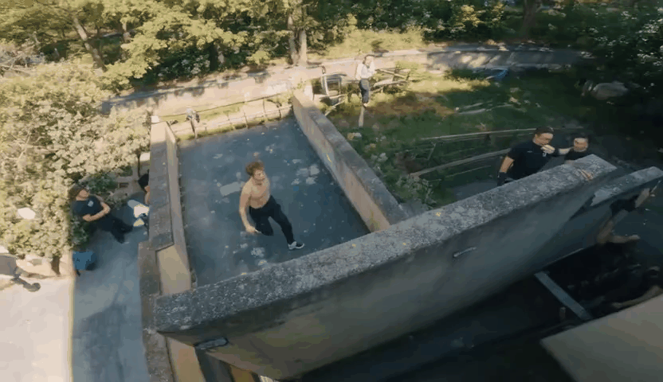
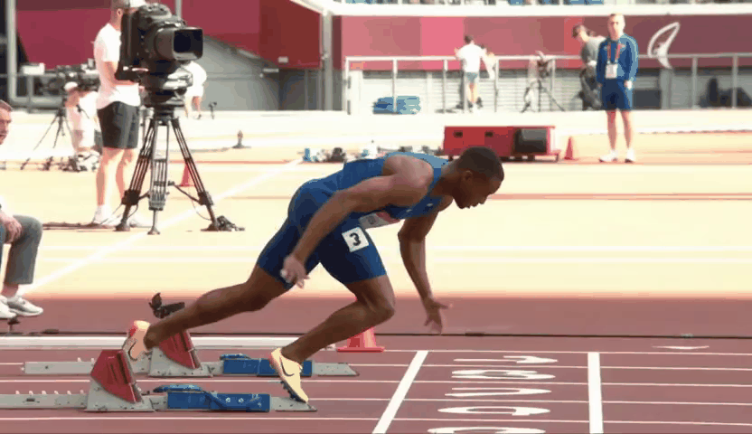
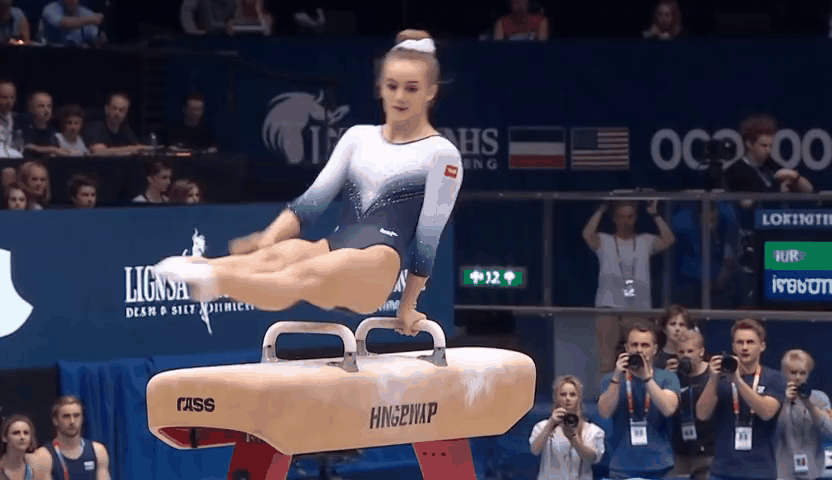

# Self-Refining Video Sampling
Official Pytorch Implementation of Self-Refining Video Sampling

**[ICML 2026]**-**[Self-Refining Video Sampling](https://github.com/agwmon/self-refine-video)**
<br/>
[Sangwon Jang<sup>*</sup>](https://agwmon.github.io/), [Taekyung Ki<sup>*</sup>](https://taekyungki.github.io), [Jaehyeong Jo<sup>*</sup>](https://harryjo97.github.io/), [Saining Xie](https://www.sainingxie.com/), [Jaehong Yoon<sup>†</sup>](https://jaehong31.github.io/), [Sung Ju hwang<sup>†</sup>](http://www.sungjuhwang.com/)
<br/>(* indicates equal contribution, † indicates equal advising)

[](https://agwmon.github.io/self-refine-video/) [](https://arxiv.org/abs/2601.18577)

<p align="center"><em>Generated by Wan2.2-A14B T2V</em></p>

<p align="center">

|  |  |  |
|:---:|:---:|:---:|
|  |  |  |
| <sub>A parkour athlete runs up a vertical wall, grabs the ledge, and muscles up to stand on the roof in one fluid motion.</sub> | <sub>A sprinter explodes out of the starting blocks, body at a 45-degree angle, transitioning into an upright running posture.</sub> | <sub>A gymnast on a pommel horse swings their legs in wide circles (flares), supporting their entire weight on alternating hands.</sub> |
</p>

## Overview

This repo is organized into two main branches:

```
self-refine-video
├─ (current)        : Wan Series (Based on Diffusers)
└─ cosmos2.5-predict: Cosmos 2.5 predict code
```


## Dependencies

> 2026.02.01: 🚨 There is a Wan model loading error with `transformers==5.0.0`. Please use `transformers==4.57.3` until this issue is fixed.

Follow the model card for environment details:
- https://huggingface.co/Wan-AI/Wan2.2-T2V-A14B-Diffusers

Minimum dependencies (install in your environment):
- diffusers
- transformers
- torch
- pip install opencv-python imageio imageio-ffmpeg

## Usage

Edit prompts and hyperparameters in [inference_pnp.py](inference_pnp.py) (T2V) or [inference_i2v_pnp.py](inference_i2v_pnp.py) (I2V), then run the script.

## Bibtex
```
@article{jang2026selfrefining,
      title={Self-Refining Video Sampling}, 
      author={Sangwon Jang and Taekyung Ki and Jaehyeong Jo and Saining Xie and Jaehong Yoon and Sung Ju Hwang},
      year={2026},
      journal={arXiv preprint arXiv:2601.18577},
}
```

## 🙏 Acknowledgements
This work builds upon:
* Diffusers - [Wan pipeline](https://github.com/huggingface/diffusers/tree/main/src/diffusers/pipelines/wan)
* Cosmos2.5 - [Github](https://github.com/nvidia-cosmos/cosmos-predict2.5)
